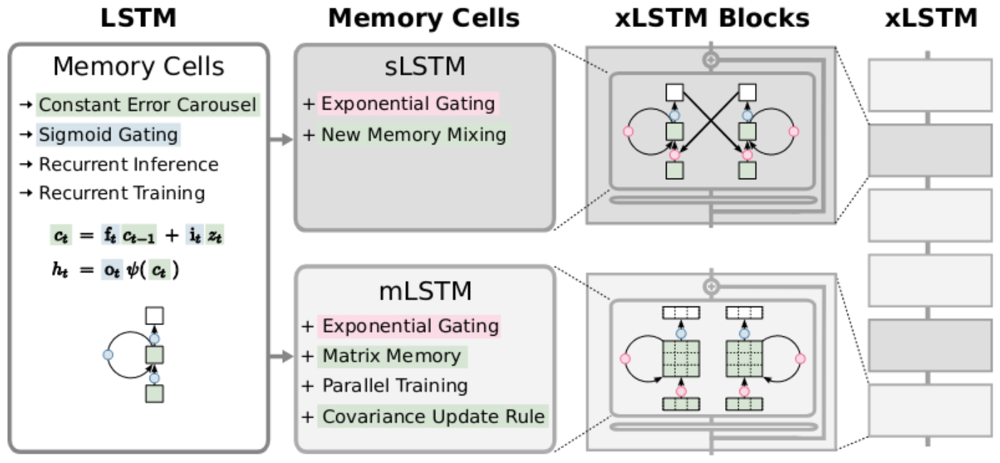

# xLSTM: Extended Long Short-Term Memory

simple xLSTM implementation in pytorch
[arxiv](https://arxiv.org/abs/2405.04517)

    

### References:
- [NX-AI/xlstm](https://github.com/NX-AI/xlstm/tree/main)
- [muditbhargava66/PyxLSTM](https://github.com/muditbhargava66/PyxLSTM/tree/main)
- [styalai/xLSTM-pytorch](https://github.com/styalai/xLSTM-pytorch)
